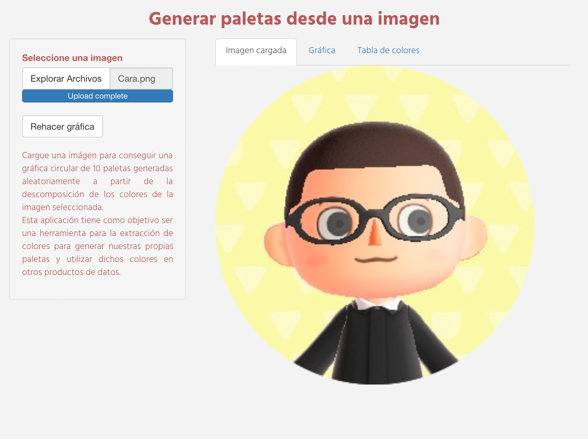
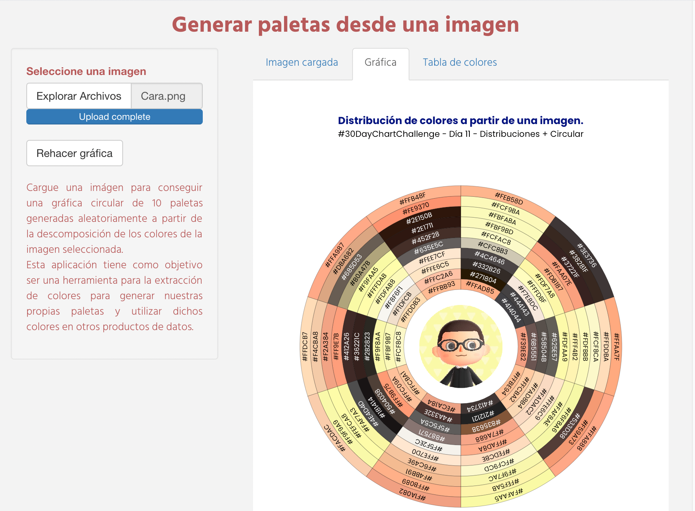
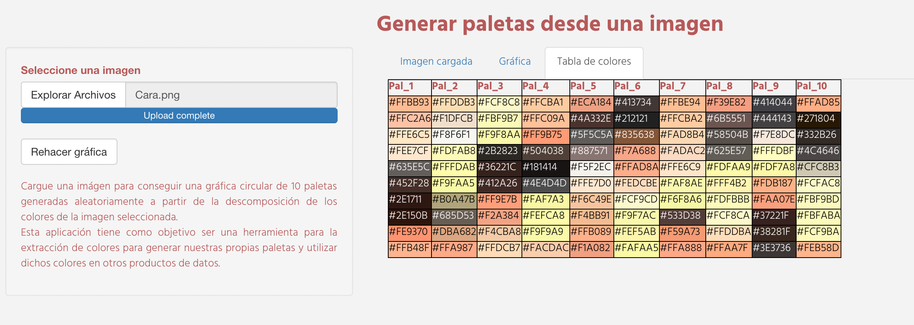

# Código: Aplicación para paletas de colores. 

Aplicación shiny para extraer paletas de colores a partir de una imagen. 

## Introducción. 

La idea para hacer esta aplicación fue extender el código que realicé para el #30DayChartChallenge a cualquier imagen existente, de la manera más sencilla posible (solo seleccionando una imagen, y ya).

## Funcionamiento. 

La aplicación toma una imagen, la convierte en un `data.frame` donde cada celda es el valor del color hexadecimal de la imagen subida. A partir de esta descomposición en pixeles, el programa toma 10 muestras aleatoria de 10 colores para generar paletas de colores aleatorias. 

## Secciones

**Sección 1. Imagen cargada**

Acá se muestra la imagen cargada dentro de la `shinyapp`. 

**Sección 2. Gráfico circular**

En esta sección, se replica la gráfica presentada en el #30DayChartChallenge; la cual es una gráfica de barras circular con la imagen de referencia en el centro. 

**Sección 3. Tabla de colores**

En esta sección, el usuario puede copiar y pegar los colores extraídos de la imagen. 

## Aprendizajes. 

Esta gráfica fue la más complicada de todas las que me puse a hacer dentro del desafío del #30DayChartChallenge de abril del 2021. Parte de los conceptos que la complicaron fueron: 

a) Lo complicado de hacer gráficas en el sistema de coordenadas polar (y de incluir imagenes en estos).  

b) El uso de imagenes como otra forma de bases de datos. 

c) Lo complicado de ordenar los colores (no hay métodos computarizados que den un resultado uniforme). 

d) El detectar cuando se deben usar letras blancas y negras, dependiendo del color de fondo. 

e) El manejo de archivos externos en una aplicación shiny. 

Es por estos conceptos previos que, si bien la aplicación es bastante sencilla, vale la pena darle una revisada; cualquiera puede aprender de esta experiencia. 

### Complicaciones. 

Al subirla a internet, tuve la complicación de que no carga bien las imagenes. Sospecho que es porque una de las librerías es de `Bioconductor`, o que no tiene la memoria necesaria para llevar a cabo todo el proceso de descomposición de las imagenes; sin embargo, descargando el código de este repositorio y las librerías necesarias se puede ejecutar de manera local de forma bastante satisfactoria. 

### Créditos. 

- Jorge Juvenal Campos Ferreira. 

### Inspiración. 

Me basé fuertemente en este código: https://gist.github.com/jeroen/bd1d0a30e7184a5320695ee2bda12c70

En esta aplicación se establece un método para manipular imagenes y leerlas desde un shiny. Igualmente, de mi entrada en el desafío del #30DayChartChallenge del Abril del 2021. 

